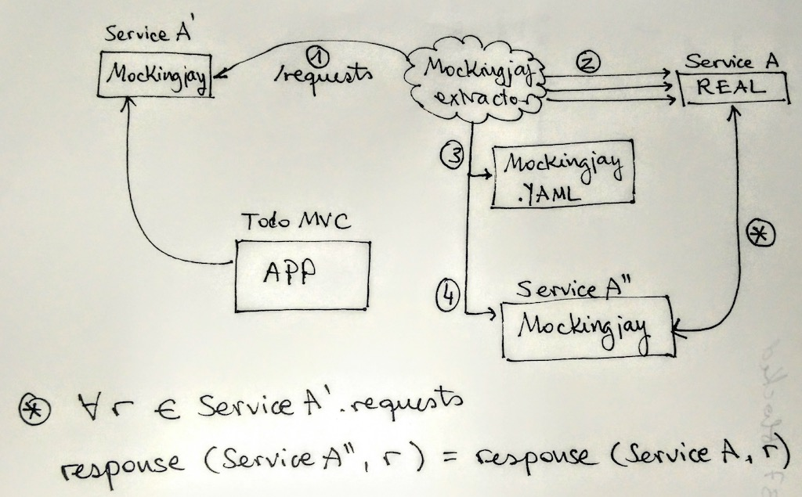

# Mockingjay Extractor

This is a helper tool for [Mockingjay Server](https://github.com/quii/mockingjay-server/)

## What is this tool for

  * Extracting the requests from a running mockingjay service
  * Getting the real data from a another service
  * Outputting the data in YAML format, ready to be consumed by mockingjay again

## Use case

Note: the property reads: for every request captured in `Service A'`, the generated `Service A''` will have the same response as `Service A`

  * You have a running mockingjay service
  * You want to add fake data to the fake service from a real service
  * You don't want to do it manually
  
## Usage

Take a look at the [`run.bash`](./run.bash) file. The program requires:

  * The URL or path containing `requests` JSON ([More info](https://github.com/quii/mockingjay-server/#inspect-what-requests-mockingjay-has-received))
  * The output file for the YAML
  * The URL for the real service
